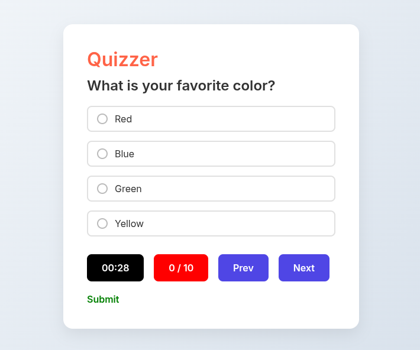

# Quizzer 🎯

A sleek, responsive quiz application built entirely with **vanilla JavaScript**, **HTML**, and **CSS** — without using any libraries or frameworks. It features a real-time timer, score tracking, previous/next navigation, and a polished UI. All interactions are handled using native DOM methods only.



---

## ✨ Features

- ⏱️ **Timer** – Live countdown for each quiz session.  
- 📊 **Score Tracker** – Updates instantly as the quiz progresses.  
- 🔘 **Multiple Choice** – User-friendly radio button options.  
- 🔄 **Prev/Next Navigation** – Move smoothly through questions.  
- ✅ **Submit Option** – Finalizes the quiz and shows results.  
- 💡 **Responsive Design** – Works well on both desktop and mobile.  
- 🚫 **No libraries used** – 100% handcrafted with pure JavaScript.

---

## 🚀 How to Use

1. Clone the repository:
   ```bash
   git clone https://github.com/your-username/quizzer.git
   ```

2. Open the `index.html` file in your browser to start the quiz.

---

## 🧠 What I Learned

- Mastered DOM selection and manipulation without libraries.
- Implemented quiz logic from scratch (timer, score, navigation).
- Built a fully responsive and accessible UI using just CSS.
- Strengthened understanding by teaching it to friends for 4 hours — from scratch.

---

## 📸 Preview

> Here's what it looks like:
> I have't wrote the css.


---

## 🙌 Acknowledgments

Built with 💻, 🔥, and pure JavaScript — no Google, no Stack Overflow.

---

## 📃 License

This project is licensed under the [MIT License](LICENSE).

